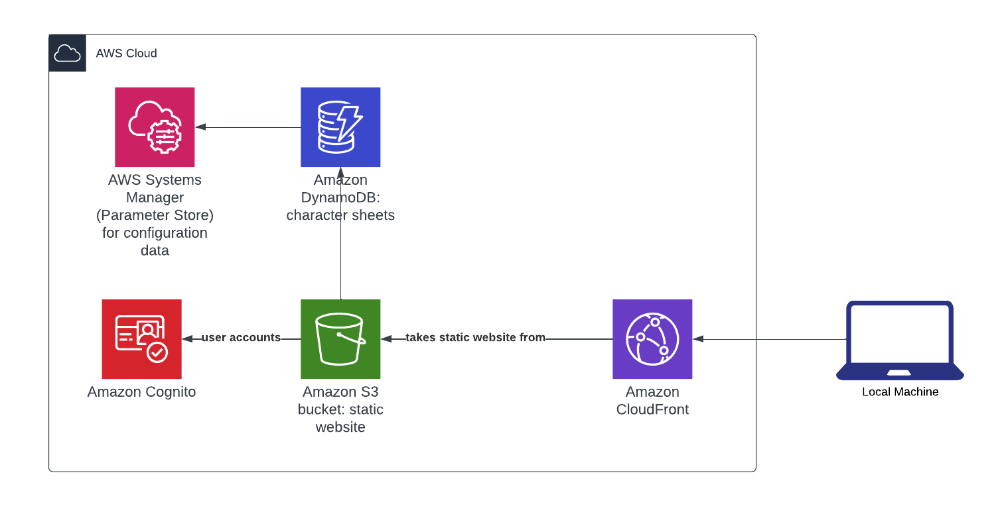

# pnp-character-application

Serverless web application for character sheets of a custom Pen & Paper game.

## Architecture

## Local development setup

- Install the following tools
  - aws-cli
  - Terraform
  - [tflint](https://github.com/terraform-linters/tflint)
- Run `terraform init` in the `/terraform` working directory to initialize Terraform
  - Rerun this command if a module or backend configuration for Terraform is set or changed. This will then reinitialize the working directory
- Run `make lint-init-terraform` to install the plugins defined in `.tflint.hcl`

## Tech stack

- [Amazon Web Services (AWS)](https://aws.amazon.com/) for the infrastructure
- Frontend: [React](https://react.dev/) with TypeScript
- [CircleCI](https://circleci.com/) for the CI/CD pipeline
- [HCP Terraform Cloud](https://app.terraform.io) for infrastructure as code
- [tflint](https://github.com/terraform-linters/tflint) as linter for Terraform
