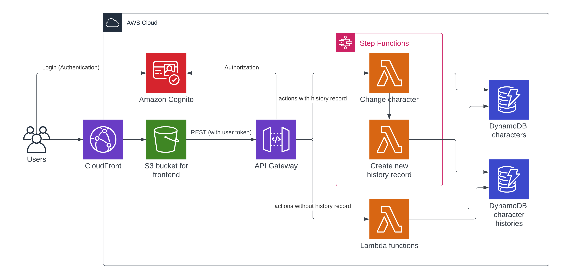

# PnP Character Application "World Hoppers"

[](https://circleci.com/gh/der-jd/pnp-character-application)

Serverless web application for characters of a custom Pen & Paper game called "World Hoppers".

## 🎯 Quick Start

```bash
# Install dependencies
npm install

# Install linter for terraform
npm install-lint-terraform

# Initialize Terraform
cd terraform && terraform init

# Start frontend development
npm run dev --workspace frontend
```

## 🏗️ Architecture



### Tech Stack

- **Cloud**: [Amazon Web Services (AWS)](https://aws.amazon.com/)
- **Frontend**: Static website with [Next.js](https://nextjs.org/), hosted with [AWS S3](https://aws.amazon.com/s3/) and [AWS CloudFront](https://aws.amazon.com/cloudfront/)
- **Backend REST API**: exposed via [AWS API Gateway](https://aws.amazon.com/api-gateway/)
- **Backend**: [Node.js](https://nodejs.org/) AWS Lambda functions and Step Functions
- **Infrastructure**: [Terraform](https://www.terraform.io/) + [HCP Terraform Cloud](https://developer.hashicorp.com/terraform/cloud-docs)
- **CI/CD**: [CircleCI](https://circleci.com/)
- **Database**: [DynamoDB](https://aws.amazon.com/dynamodb/)
- **Authentication**: [AWS Cognito](https://aws.amazon.com/cognito/)
- **API schema**: Definitions and validations with [Zod](https://zod.dev/)
- **Testing**: [Vitest](https://vitest.dev/)
- **Logging**: [AWS CloudWatch](https://aws.amazon.com/cloudwatch/)

## 🚀 Deployment

**Continuous deployment** via CircleCI, see [CircleCI Configuration](./.circleci/README.MD) for details.

## 📁 Repository Structure

```
pnp-character-application/
├── .circleci/          # CI/CD configuration
├── api-spec/           # Shared API types and schemas
├── backend/            # Node.js Lambda functions and Step Functions
├── frontend/           # Next.js client application
├── scripts/            # Utility CLI tools
├── terraform/          # AWS infrastructure
└── package.json        # Workspace configuration
```

## Navigation

### 📁 **Component Guides**

- **[📜 API Spec](./api-spec/README.md)** - API types and schemas
- **[🔧 Backend](./backend/README.md)** - Lambda functions and business logic
- **[🎨 Frontend](./frontend/README.md)** - Next.js client application
- **[🏗️ Infrastructure](./terraform/README.md)** - AWS resources and deployment

### 📚 **Specialized Topics**

- **[🧪 Backend - Unit Tests](./backend/test/unit-tests/README.md)**
- **[🧪 Backend - Component Tests](./backend/test/component-tests/README.md)**
- **[🚀 CI/CD Pipeline](./.circleci/README.MD)**
- **[🤖 AI Agent Guide](./AGENTS.md)**
