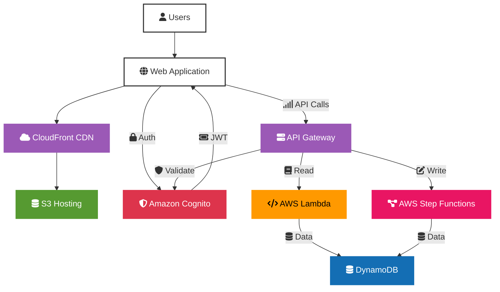

# PnP Character Application "World Hoppers"

[](https://circleci.com/gh/der-jd/pnp-character-application)

Serverless web application for characters of a custom Pen & Paper game called "World Hoppers".

## 🎯 Quick Start

```bash
# Install dependencies
npm install
```

### Required local environment variables

Create a `.env.local` file in the repository root for local frontend development, backend component tests, and Terraform-based workflows:

```bash
# Create a .env.local file in the repository root
cat <<'EOF' > .env.local
# All environment variables for local development against the dev environment

# Backend component tests
export COMPONENT_TESTS_API_BASE_URL="https://api.dev.worldhoppers.de/v1"
export COMPONENT_TESTS_COGNITO_REGION="eu-central-1"
export COMPONENT_TESTS_COGNITO_APP_CLIENT_ID="<dev-cognito-app-client-id>"
export COMPONENT_TESTS_COGNITO_USERNAME="<dev-component-test-username>"
export COMPONENT_TESTS_COGNITO_PASSWORD="<dev-component-test-password>"

# Terraform environment variables for local deployment
export TF_CLOUD_ORGANIZATION="<your-terraform-cloud-organization>"
export TF_TOKEN_app_terraform_io="<your-terraform-cloud-api-token>"
# Development workspace
export TF_WORKSPACE="<your-terraform-dev-workspace>"
# Shared workspace (optional)
#export TF_WORKSPACE="<your-terraform-shared-workspace>"
export TF_VAR_alert_email_address="<your-alert-email-address>"

# Frontend environment variables
export VITE_APP_ENV="dev"
export VITE_API_BASE_URL="https://api.dev.worldhoppers.de/v1"
export VITE_COGNITO_REGION="eu-central-1"
export VITE_COGNITO_APP_CLIENT_ID="<dev-cognito-app-client-id>"

# General test user for manual testing
export GENERAL_TEST_USER_EMAIL="<test-user-email>"
export GENERAL_TEST_USER_PASSWORD="<test-user-password>"
EOF
```

Do **not** commit real tokens, passwords, or test-user secrets!

### Backend local development

There is no long-running local backend server in this repository. The backend is developed as Lambda and Step Function code, then built and tested locally:

```bash
# Type-check and bundle the backend Lambdas
npm run build --workspace backend

# Run backend unit tests
npm run test:unit --workspace backend
```

### Start the frontend

Start the frontend against the deployed dev backend:

```bash
# Start the frontend against the deployed dev backend
npm run dev --workspace frontend
```

The frontend runs locally, but it connects to the deployed development API and Cognito user pool. Backend changes must therefore be deployed to the dev environment before you can verify them through the frontend.

### Optional infrastructure setup

If you are working on Terraform, initialize the infrastructure tooling as well:

```bash
npm run install-lint-terraform
(cd terraform/app && terraform init)
(cd terraform/shared && terraform init)
```

### User management scripts

The user pool uses `admin_only` account recovery and `AllowAdminCreateUserOnly`, so all user management is done via CLI scripts.

**Create a new user:**

```bash
./scripts/create-cognito-user.sh -u user@example.com -p {your-aws-profile} -e {dev or prod}
```

Generates a random temporary password and prints it to the console. The user must change it on first login. Deliver it to the user out-of-band.

**Reset a user's password:**

```bash
# Temporary password (user must change it on next login)
./scripts/reset-cognito-user-password.sh -u user@example.com -p {your-aws-profile} -e {dev or prod}

# Permanent password (no forced change)
./scripts/reset-cognito-user-password.sh -u user@example.com -p {your-aws-profile} -e {dev or prod} --permanent
```

The script generates a random password and prints it to the console. Deliver it to the user out-of-band. The AWS Console "Reset password" button is not available with `admin_only` recovery.

**Migrate users between pools:**

```bash
# Dry run first
./scripts/migrate-cognito-users.sh -s eu-central-1_OLD -t eu-central-1_NEW -p {your-aws-profile} --dry-run

# Execute migration
./scripts/migrate-cognito-users.sh -s eu-central-1_OLD -t eu-central-1_NEW -p {your-aws-profile}
```

Migrates email addresses to a new pool. Users receive a new sub and an invitation email with a temporary password. See the script's `--help` for details on sub mapping.

## 🏗️ Architecture


```mermaid
graph TB
    %% User Interface Layer
    User[fa:fa-user Users] --> WebApp[fa:fa-globe Web Application]

    %% Content Delivery
    WebApp --> CloudFront[fa:fa-cloud CloudFront CDN]
    CloudFront --> S3[fa:fa-database S3 Hosting]

    %% Authentication & Security
    WebApp --> |fa:fa-lock Auth| Cognito[fa:fa-shield-alt Amazon Cognito]
    Cognito --> |fa:fa-ticket JWT| WebApp

    %% API Layer
    WebApp --> |fa:fa-signal API Calls| APIGW[fa:fa-server API Gateway]
    APIGW --> |fa:fa-shield Validate| Cognito

    %% Compute Layer
    APIGW --> |fa:fa-book Read| Lambda[fa:fa-code AWS Lambda]
    APIGW --> |fa:fa-edit Write| StepFunctions[fa:fa-project-diagram AWS Step Functions]

    %% Data Layer
    Lambda --> |fa:fa-database Data| DynamoDB[fa:fa-database DynamoDB]
    StepFunctions --> |fa:fa-database Data| DynamoDB

    %% Styling
    classDef frontend fill:#ffffff,stroke:#333333,stroke-width:2px,color:#333333
    classDef compute fill:#FF9900,stroke:#FF9900,stroke-width:2px,color:#000000
    classDef data fill:#146EB4,stroke:#146EB4,stroke-width:2px,color:#ffffff
    classDef storage fill:#569A31,stroke:#569A31,stroke-width:2px,color:#ffffff
    classDef api fill:#9B59B6,stroke:#9B59B6,stroke-width:2px,color:#ffffff
    classDef workflow fill:#E91563,stroke:#E91563,stroke-width:2px,color:#ffffff
    classDef security fill:#DD344C,stroke:#DD344C,stroke-width:2px,color:#ffffff

    class User,WebApp frontend
    class Lambda compute
    class StepFunctions workflow
    class DynamoDB data
    class S3 storage
    class CloudFront,APIGW api
    class Cognito security
```

### Tech Stack

- **Cloud**: [Amazon Web Services (AWS)](https://aws.amazon.com/)
- **CDN**: [AWS CloudFront](https://aws.amazon.com/cloudfront/)
- **Frontend**: Static website with [React](https://react.dev/) + [Vite](https://vite.dev/) + [Tailwind CSS](https://tailwindcss.com/), hosted with [AWS S3](https://aws.amazon.com/s3/)
- **API schema**: Definitions and validations with [Zod](https://zod.dev/)
- **Backend REST API**: exposed via [AWS API Gateway](https://aws.amazon.com/api-gateway/)
- **Backend**: [Node.js](https://nodejs.org/) AWS Lambda functions and Step Functions
- **Infrastructure as Code**: [Terraform](https://www.terraform.io/) + [HCP Terraform Cloud](https://developer.hashicorp.com/terraform/cloud-docs)
- **CI/CD**: [CircleCI](https://circleci.com/)
- **NoSQL Database**: [DynamoDB](https://aws.amazon.com/dynamodb/)
- **Authentication**: [AWS Cognito](https://aws.amazon.com/cognito/)
- **DNS & Domain management**: [AWS Route53](https://aws.amazon.com/route53/)
- **Data Backup**: [AWS Backup](https://aws.amazon.com/backup/)
- **Testing**: [Vitest](https://vitest.dev/)
- **Monitoring & Logging**: [AWS CloudWatch](https://aws.amazon.com/cloudwatch/)
- **Alerting**: [AWS SNS](https://aws.amazon.com/sns/)

## 💾 Data Backup Strategy

The application implements a backup strategy using **AWS Backup** to ensure data durability and recovery capabilities:

- **Automated Backup Schedule**: Daily backups and monthly backups
- **Retention Policy**: Prod keeps daily backups for 90 days and monthly backups for 730 days; dev keeps shorter retention to limit cost
- **Backup Monitoring**: CloudWatch alarms alert on failed or expired backup jobs via SNS notifications

Backup configurations are managed through Terraform in the `terraform/backup.tf` module.

## 📊 Monitoring, Dashboards & Alerting

The application includes backend monitoring and alerting to track application health and performance, see [Monitoring & Alerting](./terraform/README.md#monitoring--alerting-configuration) for details.

## 🚀 Deployment

CircleCI runs a dev deployment workflow on every branch and a separate prod deployment workflow on every commit to `main` (continuous deployment). See [CircleCI Configuration](./.circleci/README.md) for details.

## 📁 Repository Structure

```
pnp-character-application/
├── .circleci/          # CI/CD configuration
├── api-spec/           # Shared API types and schemas
├── backend/            # Node.js Lambda functions and business logic
├── frontend/           # React + Vite client application
├── scripts/            # Utility CLI tools
├── terraform/          # AWS infrastructure
└── package.json        # Workspace configuration
```

## Navigation

### 📁 **Component Guides**

- **[📜 API Spec](./api-spec/README.md)** - API types and schemas
- **[🔧 Backend](./backend/README.md)** - Lambda functions and business logic
- **[🎨 Frontend](./frontend/README.md)** - React + Vite client application
- **[🏗️ Infrastructure](./terraform/README.md)** - AWS resources and deployment

### 📚 **Specialized Topics**

- **[🧪 Backend - Unit Tests](./backend/test/unit-tests/README.md)**
- **[🧪 Backend - Component Tests](./backend/test/component-tests/README.md)**
- **[🚀 CI/CD Pipeline](./.circleci/README.md)**
- **[🤖 AI Agent Guide](./AGENTS.md)**
