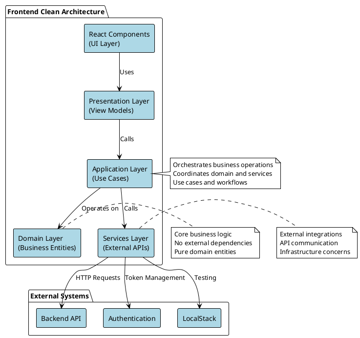
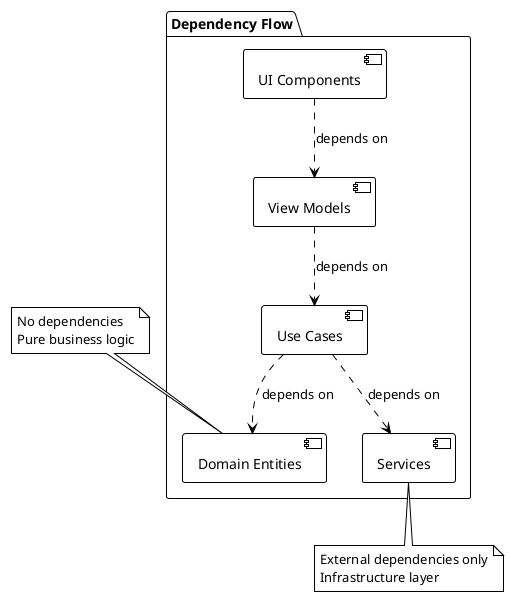
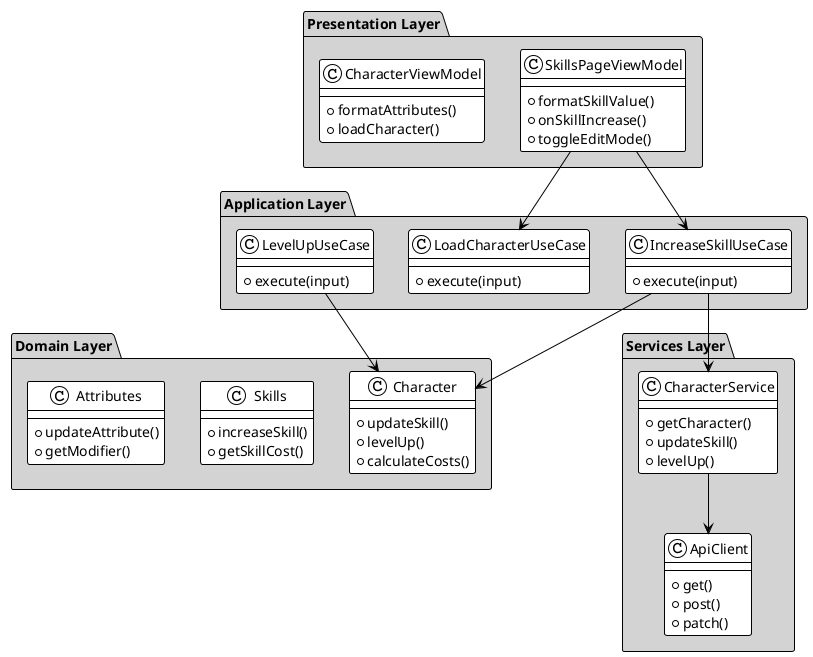
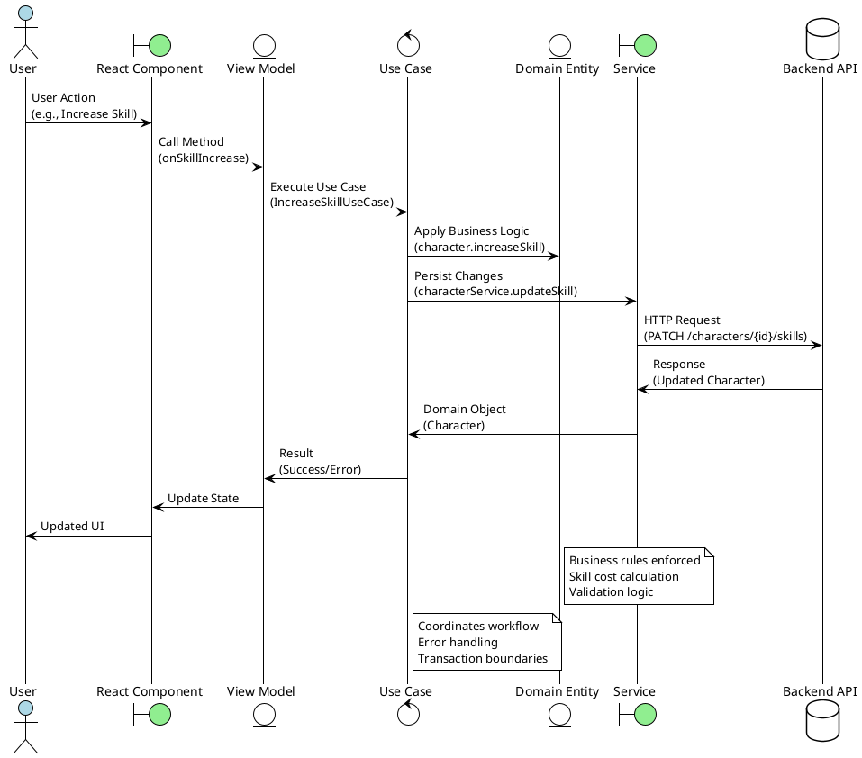
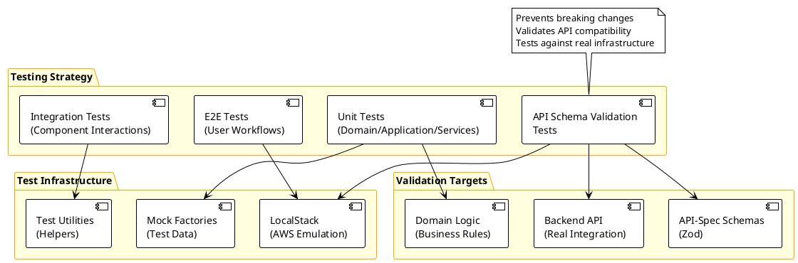
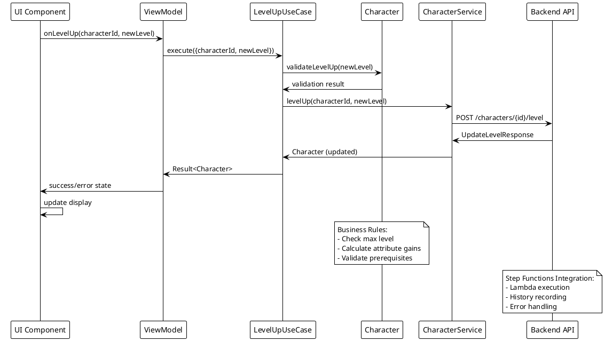
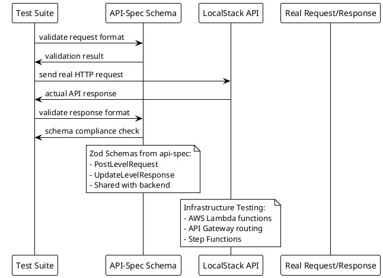

# Frontend Architecture Documentation

This documentation covers the frontend architecture of the PnP Character Application, following Clean Architecture principles with clear separation of concerns.

## Architecture Overview

The frontend is organized in layers following Clean Architecture patterns with clear dependency flow and separation of concerns.

### Clean Architecture Layers

### Layer Dependencies

## Detailed Architecture Diagrams

### Component Architecture

### Data Flow Architecture

### Testing Architecture

## Layer Documentation

- [Domain Layer](./domain.md) - Core business entities and domain logic
- [Application Layer](./application.md) - Use cases and application services
- [Presentation Layer](./presentation.md) - View models and presentation logic
- [Services Layer](./services.md) - External service integrations
- [Testing Strategy](./testing.md) - Testing approaches and API schema validation

## Architecture Principles

1. **Dependency Inversion**: Inner layers don't depend on outer layers
2. **Single Responsibility**: Each layer has a clear, focused purpose
3. **Separation of Concerns**: Business logic is separated from presentation and infrastructure
4. **Testability**: Each layer can be tested independently

## Use Case Flow Examples

### Level Up Character Flow

### API Schema Validation Flow

## Project Structure

```plantuml
@startuml Project_Structure
!theme plain
skinparam backgroundColor white
skinparam folder {
    BackgroundColor lightcyan
    BorderColor navy
}

folder "frontend/src/" {
    folder "app/" {
        file "page.tsx"
        file "layout.tsx"
        folder "characters/"
    }

    folder "hooks/" {
        file "useCharacter.ts"
        file "useSkillIncrease.ts"
    }

    folder "lib/" {
        folder "application/" {
            folder "use-cases/" {
                file "LevelUpUseCase.ts"
                file "IncreaseSkillUseCase.ts"
                file "LoadCharacterUseCase.ts"
            }
            folder "services/" {
                file "CharacterApplicationService.ts"
            }
        }

        folder "domain/" {
            file "Character.ts"
            file "Skills.ts"
            file "Attributes.ts"
        }

        folder "presentation/" {
            folder "viewmodels/" {
                file "SkillsPageViewModel.ts"
            }
        }

        folder "services/" {
            file "characterService.ts"
            file "apiClient.ts"
            file "authService.ts"
        }

        folder "types/" {
            file "result.ts"
            file "index.ts"
        }
    }

    folder "test/" {
        folder "api-schema/" {
            file "level-up-api-schema-validation.test.ts"
        }
        file "LevelUpUseCase.test.ts"
        file "Character.test.ts"
    }
}

@enduml
```

## Getting Started

Each layer documentation provides:

- Purpose and responsibilities
- Key components and their roles
- Usage examples
- Testing approaches

Navigate to the specific layer documentation for detailed information.
